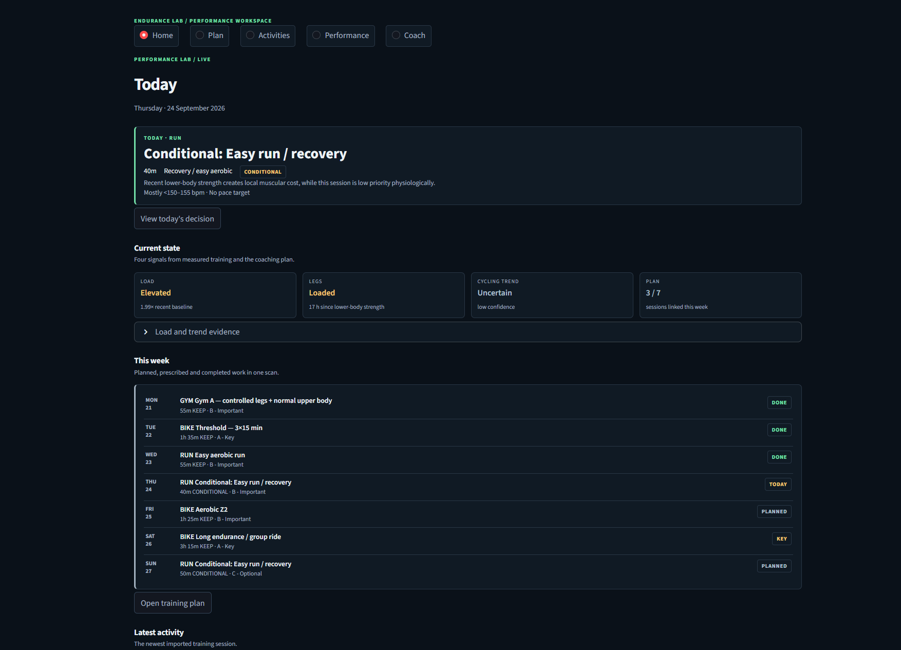
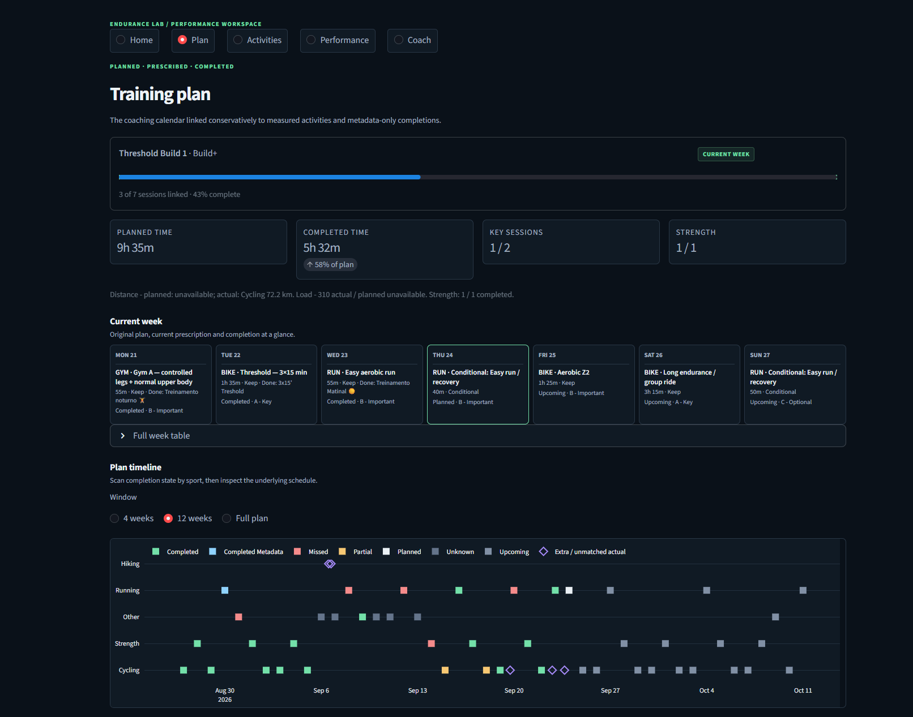
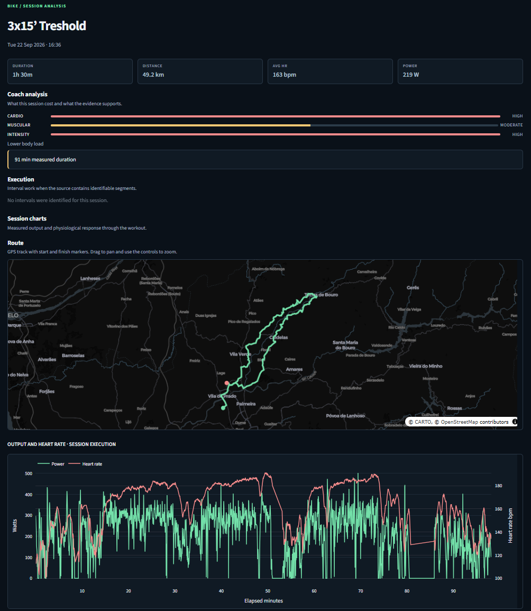
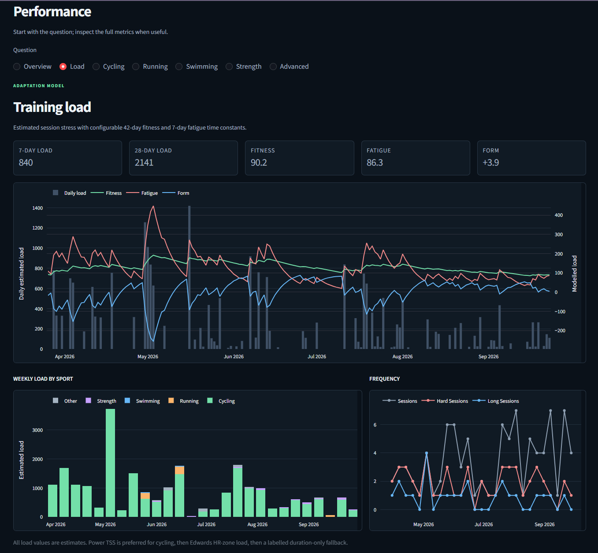

# Endurance Lab

Endurance Lab is a private, local-first application for bringing endurance and strength training data into one place.

It combines activities recorded by different devices and services, turns them into one consistent training history, calculates useful performance indicators, and presents the results in an interactive dashboard. The application is designed for a single athlete who wants ownership of their data without depending on a hosted analytics platform.

## The dashboard

The interface is a dark, responsive performance workspace. These four screenshots show the Home, Plan, activity-detail, and Performance views.

### Home



### Training plan



### Activity detail



### Performance



## What the application does

### Builds one training history

Endurance Lab reads FIT, TCX, and supported strength-training JSON files. These formats may come from Garmin devices, cycling computers, Strava exports, Hevy, or other compatible sources.

Although every format describes activities differently, the application converts them into one shared structure. A ride, run, swim, strength session, or other workout can then be analysed consistently regardless of where it originated.

### Preserves the detail behind each activity

When available, the application retains:

- date, sport, duration, moving time, and distance;
- elevation, calories, and device information;
- GPS position and altitude;
- heart rate, cadence, speed, power, and temperature;
- laps and full time-series data;
- strength exercises, sets, repetitions, and recorded loads;
- source identity and import history.

Original files are preserved separately from the normalized database. This makes it possible to improve the importer later without losing the source data.

### Avoids duplicate activities

The same workout can appear in more than one format—for example, as both FIT and TCX. Endurance Lab first uses source activity IDs and then applies conservative comparisons based on time, sport, duration, and distance.

When a richer version of an existing activity is imported, it can improve the stored record without removing better information that is already present. Ambiguous matches are kept separate instead of being merged aggressively.

### Calculates training and performance metrics

The analytics layer turns raw activity data into views such as:

- weekly training volume and sport distribution;
- estimated session load;
- fitness, fatigue, and form trends;
- cycling power-duration curves;
- 20-minute power history;
- power-to-heart-rate efficiency;
- aerobic drift and decoupling;
- running pace and heart-rate economy;
- long-run durability;
- swimming pace and lap consistency;
- strength frequency and exercise history;
- best efforts and comparable sessions.

Calculated or estimated values are labelled. When the source data is not sufficient for a metric, the dashboard leaves it unavailable instead of inventing a value.

### Makes individual activities inspectable

The activity-detail view aligns the recorded streams on a common timeline. It exposes laps, zones, best efforts, session halves, drift, pace, heart rate, cadence, power, elevation, and other available signals. Heart-rate and power-zone charts show their actual bpm and watt ranges, not just zone numbers. Power ranges use the FTP that applied on the activity date, so historical rides retain their original reference.

The activity library can be filtered and searched, making the application useful both for long-term trends and for investigating one session.

### Presents training as a performance workspace

The responsive interface has five primary areas: **Home, Plan, Activities, Performance, and Coach**. Home starts with today's prescribed session, the reason behind the decision, current training state, this week's plan, and the latest completed activity. The Plan view places original work, current prescriptions, and linked completions together. Activities use a compact feed before opening the measured session detail. Performance keeps the deep charts and metrics, while Coach explains adjustments and separate cardiovascular, muscular, and intensity costs.

The visual hierarchy is answer, evidence, then raw data. Detailed tables, zones, comparisons, and decision traces remain available in expandable sections. A compact navigation row stays visible on phone screens; filters are collapsed until needed. [Dashboard design and audit](docs/DASHBOARD_REDESIGN.md) records the structure and current visual-testing limitation.

### Reports data quality

The application reports coverage and suspicious data without silently deleting anything. Examples include missing heart rate, cycling sessions without power, missing distance, sparse streams, unusual values, truncated recordings, and large gaps in GPS time.

These warnings are advisory. The source file and normalized activity remain available for review.

### Creates a private Strava archive

Endurance Lab includes a small personal Strava export tool. It works from a private manifest of activity IDs and downloads the original activity file when Strava provides one, falling back to TCX where possible.

The export process is:

- sequential and deliberately conservative;
- resumable after interruption;
- aware of files that are already present;
- able to validate FIT, TCX, and supported JSON by their actual contents;
- able to reject login pages, ordinary HTML pages, malformed files, and unsupported responses;
- designed to stop safely when authentication expires or Strava reports a rate limit;
- able to reconcile expected activities, local files, and database records.

Authentication is performed manually in a persistent local browser profile. Endurance Lab does not handle usernames, passwords, MFA responses, or CAPTCHA challenges.

Some manually created activities and older third-party integrations have no downloadable original file and no GPS data from which Strava can produce TCX. Automated sync preserves these as clearly labelled metadata-only activities; the application does not fabricate replacement files or sensor streams.

### Keeps itself current with one sync command

The normal update path is now `python -m endurance_lab sync`. Using the existing signed-in browser profile, it discovers recent activities directly from the athlete's Strava training list, updates the private manifest, downloads only missing exports, imports new data, checks data quality, refreshes affected analytics, matches completed training to the plan, calculates session cost, and updates upcoming coaching prescriptions.

Daily discovery starts five days before the newest locally known activity. This overlap catches delayed uploads and later edits without scanning the full account. Discovery follows every results page needed to exhaust the requested date range and checkpoints each completed page, so an interrupted run can resume. The overlap is configurable through `strava_sync.lookback_days` in the private athlete configuration.

If neither the original export nor TCX exists, the activity becomes an explicit metadata-only record instead of remaining a permanent failed download. Its date, sport, name, duration, and distance can still support calendars, volume, matching, and adherence, while stream-dependent analysis stays unavailable.

The pipeline has a single-process lock, rotating private logs, stage checkpoints, and sync history. Repeating an unchanged sync skips downloads and imports that are already complete. If authentication expires, network work stops and the existing local progress is retained.

Everyday use:

```text
python -m endurance_lab sync
python -m streamlit run dashboard/app.py
```

The first Strava session is established with `python -m endurance_lab strava-login`. Authentication is still manual; the application never stores a Strava password or attempts to bypass MFA or CAPTCHA. If the session later expires, log in again and rerun `sync`.

Useful sync controls:

```text
python -m endurance_lab sync --dry-run
python -m endurance_lab sync --from 2026-09-01
python -m endurance_lab sync --skip-coaching
python -m endurance_lab sync --force-discovery
python -m endurance_lab sync --json
python -m endurance_lab sync-status
python -m endurance_lab strava-discover --from 2025-01-01 --to 2025-12-31
python -m endurance_lab strava-discover --all
```

A dry run performs authenticated discovery but does not change the manifest, download files, import activities, create sync history, or write prescriptions. Historical discovery is explicit; a normal sync never enumerates the entire account. Detailed progress and errors are written to the Git-ignored `training_data/logs/sync.log`. Existing standalone manifest, download, reconciliation, import, quality, plan, and coaching commands remain available for diagnosis.

### Local automation, phone access, and calendar delivery

The current-user automation layer can run sync hourly and start the dashboard when Windows signs in. On PCs where system VPN software cannot be installed, a signed portable ngrok agent can publish the local dashboard through an authenticated HTTPS endpoint without changing the router or firewall. Google Calendar publishing keeps completed activities in a dedicated Strava calendar and upcoming prescriptions in a separate, hideable calendar. Events are updated idempotently, and planned-session reminders provide phone notifications.

The machine must remain powered on, online, and signed in. Credentials, tunnel policy, runtime state, event links, and logs remain private. See [Automation setup](docs/AUTOMATION.md) for the one-time ngrok and Google OAuth authorization steps.

## How it is built

At a high level, the application is a pipeline:

```text
FIT / TCX / JSON files
          |
          v
    Format parsers
          |
          v
  Common activity model
          |
          v
    SQLite database
          |
          v
   Analytics engine
          |
          v
 Streamlit dashboard
```

### Parsers

Each supported file type has a dedicated parser. Its only job is to understand that format and translate it into the common activity model.

This keeps file-format details away from the analytics and dashboard.

### Common activity model

The common model is the internal description of an activity. It represents sessions, laps, trackpoints, sensor values, strength sets, provenance, and source metadata in the same way for every input format.

This is the main boundary in the architecture: everything before it understands files; everything after it understands activities.

### Normalization and storage

The normalizer cleans and aligns parsed values before storing them in SQLite. SQLite was chosen because it is reliable, portable, easy to back up, and does not require a separate database server.

The database stores both the normalized activities and the information needed to trace them back to their original source.

### Analytics

The analytics layer reads only normalized database records. It calculates sport-specific metrics, best efforts, efficiency, load, and longer-term training trends without needing to know whether an activity originally came from FIT, TCX, or JSON.

Athlete-specific values—such as dated FTP history, heart-rate zones, personal-best references, and load-model settings—are held in the Git-ignored `config/athlete.yaml`. The tracked `config/athlete.example.yaml` contains illustrative values only. Updating FTP for a new date preserves the reference used for earlier activities; power-zone boundaries and load estimates for new rides follow the new FTP. If historical zone definitions change, recalculate analytics to refresh stored zone distributions.

### Dashboard

The user interface is built with Streamlit and Plotly. Streamlit provides the local application structure, while Plotly provides interactive charts.

Its five primary destinations are Home, Plan, Activities, Performance, and Coach. Sport-specific analysis and training load live under Performance; import quality and automation status live in the secondary System & data view.

### Strava export layer

The Strava workflow is kept separate from the importer. A persistent Playwright Chromium profile supplies an authenticated local browser session, while the downloader manages the manifest, pacing, retries, validation, file naming, and resume behavior.

This separation means the ingestion and analytics system still works with activity files obtained from anywhere else.

## Training plan and coaching foundation

Endurance Lab can import a private coaching workbook from `training_data/` and connect its prescribed calendar to completed activities. The original workbook remains unchanged and Git-ignored. A content hash detects workbook changes, while a complete raw snapshot of populated cells, formulas, sheet dimensions, and merged ranges is retained as private database provenance.

The coaching model separates three ideas:

```text
Planned     the session in the annual coaching calendar
Prescribed  the version recommended for a particular date
Completed   the measured or metadata-only activity actually performed
```

Imported plan data is normalized into plans, phases, weeks, sessions, targets, source snapshots, match evidence, and prescriptions. Initial prescriptions mirror the workbook. This creates a stable place for future deterministic adaptation without changing the original plan.

Matching is conservative and explainable. An exact Strava activity ID supplied by the workbook is preferred. Otherwise, candidates are scored using date, normalized sport, duration, distance, and title or workout-type keywords. Matches are recorded as `matched`, `probable`, `ambiguous`, or `manual`, together with the evidence used. Automatic reruns never replace a manual match.

Adherence dimensions remain independent:

- duration: under, close, over, or unknown;
- distance: under, close, over, or unknown;
- intensity: easier, close, harder, or unknown;
- completion: completed, partial, missed, upcoming, unknown, or metadata-only.

The **Plan** view shows the current week, weekly summary, timeline, and session comparison. **Coach** explains current decisions, adherence, training-load context, and coaching flags.

The available plan commands are:

```text
python -m endurance_lab plan-inspect [workbook]
python -m endurance_lab plan-import [workbook]
python -m endurance_lab plan-match
python -m endurance_lab plan-status
python -m endurance_lab plan-reconcile
```

When the workbook argument is omitted, the application discovers the only sensible coaching workbook under `training_data/`.

### Workbook assumptions

The current workbook uses `Training Calendar` as its authoritative session table, with headers on row 3. A row becomes a planned session only when it has a date, sport, and non-empty planned-session title. Date-only rows still contribute to phase and week structure but are not invented as workouts.

The current calendar has explicit columns for duration, intensity, power, heart rate, pace, priority, description, status, actual-session summaries, and coaching notes. It does not have a general planned-distance or planned-load column. Distance is therefore structured only when explicitly stated in a session title; all other target text remains preserved verbatim. Complex or contextual targets remain low confidence instead of being reduced to misleading numbers.

The `Periodization`, `Workout Library`, `Weekly Review`, `Performance Metrics`, `Gym Progress`, `Athlete Profile`, `Lists`, `Update Workflow`, and workbook `Dashboard` sheets are preserved as raw provenance. They are not silently converted into extra sessions.

Summary-only activities are supported through a `metadata_only` marker. They can contribute to matching, calendars, session frequency, duration, and distance where known, but are excluded from assumptions about GPS or sensor streams.

## Adaptive coaching and prescriptions

The deterministic coaching engine starts from the imported plan and normally keeps it unchanged. It considers only activities before the prescription date, so historical simulations cannot see future training. It describes training context rather than claiming to measure physiological readiness.

Completed training is represented by a multidimensional `SessionCost`, not one fatigue number. It keeps systemic, cardiovascular, muscular, sport-specific, intensity, and duration cost separate. A long family ride can therefore remain low physiological cost while a shorter threshold ride is high cost, and a gym session can have low cardiovascular cost but high local lower-body cost.

Strength classification is exercise-aware. Configurable aliases group Hevy exercises as lower body, upper body, full body, core, or unknown. Working sets and recent exercise-specific loads distinguish upper-body training and light maintenance from meaningful leg work without inventing a strength TSS.

The weekly adjustment engine reconciles what actually happened with the remaining plan. Explicit A/B/C workbook priority is retained with its source; missing priority is inferred conservatively. It detects modality-specific interference, measures recovery runway to upcoming A sessions, protects key work, and makes the smallest defensible change. `KEEP` remains the default. Available actions are `KEEP`, `REDUCE_DURATION`, `REDUCE_INTENSITY`, `REPLACE_WITH_EASY`, `MOVE`, `SKIP`, `REST`, and `CONDITIONAL`. Missed training is not treated as debt, easy days are not topped up, and optional sessions can carry a structured recovery gate with a rest fallback.

Every prescription stores a decision trace: the original session, actual preceding activities, cost dimensions, interference flags, protected sessions, candidate actions, selected action, rules, reasons, confidence, recovery runway, and optional gate. Historical evaluation cuts evidence off before each decision date to prevent future-data leakage.

The **Coach** dashboard page shows today's prescription, its reasons, current context, the next seven days, and a plan/prescription/completed weekly comparison. An optional local daily check-in records 1–5 values for sleep quality, fatigue, leg soreness, stress, motivation, and recovery RPE. Missing feedback remains unknown rather than positive or negative.

The weekly dashboard also adds compact cost dimensions and expandable original-plan/current-prescription/actual decision traces, making every adjustment inspectable.

Useful commands are:

```text
python -m endurance_lab athlete-state [YYYY-MM-DD] [--json]
python -m endurance_lab coach-today [--json]
python -m endurance_lab coach-date YYYY-MM-DD [--json]
python -m endurance_lab coach-week [YYYY-MM-DD] [--json]
python -m endurance_lab coach-reconcile [YYYY-MM-DD] [--json]
python -m endurance_lab coach-explain YYYY-MM-DD [--json]
python -m endurance_lab classify-activity ACTIVITY_ID [--json]
python -m endurance_lab session-cost ACTIVITY_ID [--json]
python -m endurance_lab evaluate-activity ACTIVITY_ID [--json]
python -m endurance_lab coach-backtest --from YYYY-MM-DD --to YYYY-MM-DD [--json]
```

### Coaching configuration

Coaching heuristics live in the private athlete configuration, alongside FTP and heart-rate zones. They are treated as adjustable rules rather than physiological laws:

- endurance duration bands and a heat-context threshold;
- recovery-runway bands for high overlap, meaningful overlap, and generally workable spacing;
- historical strength lookback, working-set thresholds, and exercise-region aliases;

- `high_stress_recovery_hours`: minimum spacing by endurance sport;
- `leg_strength_interference_hours`: spacing before quality cycling/running;
- `consecutive_training_days_watch`: accumulated-days threshold;
- `recent_volume_ratio_watch`: actual/planned duration threshold;
- `recent_load_ratio_watch`: reserved configurable load-change context threshold;
- `duration_reduction_fraction`: retained fraction when duration is reduced;
- `minimum_prescribed_minutes`: floor for shortened sessions;
- `subjective_high_threshold`: optional 1–5 check-in threshold;
- `automatic_progression`: disabled by default;
- trend lookback, comparison window, minimum observations, and meaningful-change fraction.

Prescriptions and their evidence are persisted by date. Re-running an unchanged prescription is idempotent; a changed decision supersedes the earlier active version without deleting its history.

## Technology

- **Python** for parsing, normalization, analytics, and command-line tools
- **SQLite** for the local normalized data model
- **Pandas** for data preparation and analysis
- **Plotly** for interactive charts
- **Streamlit** for the dashboard
- **Garmin FIT SDK** for FIT decoding
- **Playwright** for persistent local Strava authentication
- **Pytest** for automated tests

## Privacy principles

Databases, raw activities, downloaded exports, manifests, browser profiles, cookies, environment files, and athlete-specific configuration remain outside Git tracking. New images in `assets/` are ignored by default. The four screenshots above were explicitly approved for publication and include real training dates and metrics; the activity-detail image also includes a GPS route. Treat them as public. Older Git commits may still contain previously published screenshots or athlete-specific example values; removing those from history requires a separate coordinated history rewrite.

The persistent browser profile is treated as a credential. It should never be committed, uploaded, shared, or included in an ordinary public backup.

The application is intended to remain local. Raw activity files may reveal locations, routines, timestamps, health information, and performance data.

## Current status

The following parts are implemented:

- normalized FIT, TCX, and strength JSON ingestion;
- source preservation, provenance, and strict deduplication;
- richer-source upgrades;
- SQLite schema and migrations;
- cross-sport analytics;
- sport-specific and activity-detail dashboards;
- configurable athlete and load-model settings;
- ingestion-quality reporting;
- persistent Strava authentication;
- automatic incremental and fully paginated Strava discovery;
- idempotent end-to-end sync with page and stage checkpoints;
- resumable and validated Strava exports;
- metadata-only fallback for activities with no available export;
- manifest/download/database reconciliation;
- sync history, rotating private logs, concurrency locking, and dashboard status;
- current-user Windows scheduling and dashboard startup;
- no-admin authenticated phone access support;
- idempotent Google Calendar events and reminder delivery;
- normalized coaching plans, phases, weeks, sessions, targets, and prescriptions;
- deterministic planned-versus-actual matching and dimensioned adherence;
- metadata-only activity support;
- Training Plan and Coaching Overview dashboard pages;
- date-bounded athlete state and sport-specific performance trends;
- explainable session/stress classification and workout execution evaluation;
- conservative adaptive prescriptions and historical backtesting;
- multidimensional endurance and exercise-aware strength cost classification;
- A/B/C priority protection, recovery runway, and modality-specific interference;
- structured optional gates and persisted decision traces;
- Coach dashboard with weekly adaptation view and optional daily check-ins;
- explainable, non-medical coaching flags;
- mocked authentication and downloader tests that do not contact live Strava.

The automated test suite currently covers the core ingestion, analytics, authentication, download, resume, validation, privacy, and reconciliation behavior.

## Planned work

### Hosted deployment

Local scheduling, dashboard startup, authenticated phone access, and Google Calendar delivery are implemented. A future hosted deployment can replace the persistent browser session with official Strava OAuth/webhooks and move private storage to an authenticated server.

### Data-quality refinement

The current warnings are intentionally cautious. Future work can refine GPS-gap detection, distinguish expected recording pauses from suspicious gaps, and provide better explanations for sport- and device-specific behavior.

### Broader file compatibility

The parser boundary makes it possible to add carefully validated formats or variants later without changing the normalized database, analytics, or dashboard.

## Known limitations

- Strava website export endpoints are not a stable public API contract and may change.
- Some manual and historical third-party activities have no downloadable activity file.
- Persistent Strava sessions eventually expire and require manual authentication again.
- Chromium cannot open the same persistent profile in two processes simultaneously.
- Cross-format matching is deliberately strict and may keep ambiguous records separate.
- Unsupported original formats, including compressed archives, are rejected.
- Strava discovery relies on an authenticated website endpoint rather than a stable public API, so a future Strava site change may require an adapter update.
- Scheduled sync runs only while the configured Windows user is signed in, and the computer must remain powered on and online.
- Phone access and Google Calendar each require a one-time account authorization that the application cannot perform on the user's behalf.
- Ambiguous plan matches require a future manual editing interface; the database already preserves manual overrides.
- Planned-load comparison remains unavailable when the workbook does not provide a planned load.
- Interval execution requires usable laps and compatible planned targets; device auto-laps are not forced into intervals.
- Performance trends remain uncertain when comparable observations are sparse, especially for running and swimming.
- Exact workbook activity IDs can represent deliberately moved sessions; sport-incompatible links remain visible but are not used for target execution judgments.
- Coaching rules provide explainable context, not medical advice or a physiological readiness score.
- The application is single-athlete and local by design; cloud hosting and multi-user support are not current goals.
