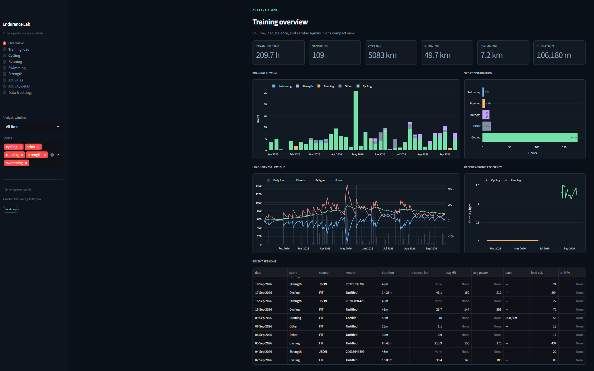
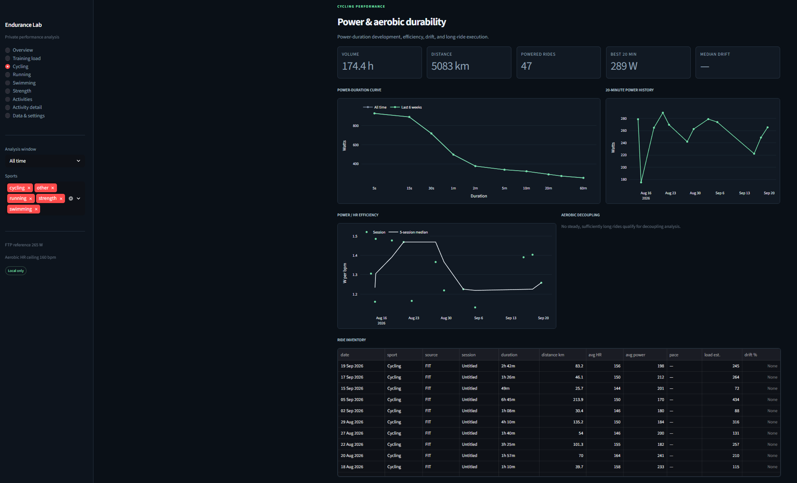
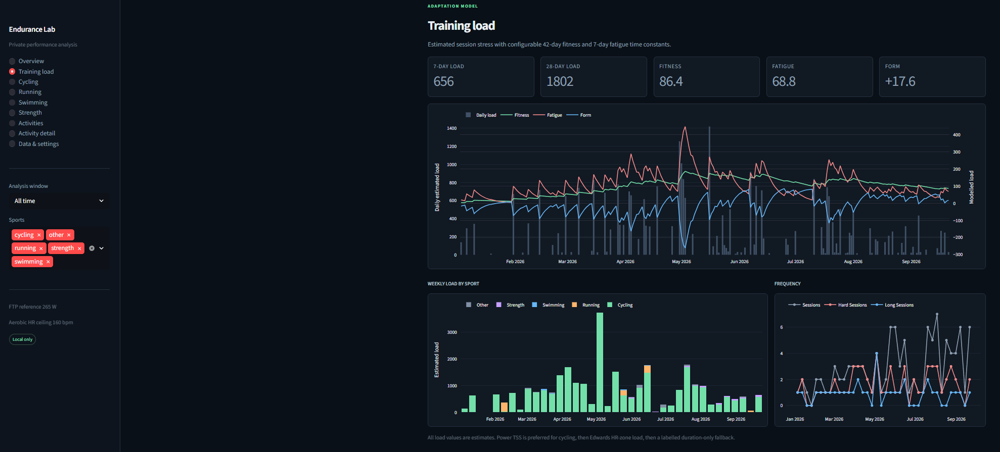

# Endurance Lab

Endurance Lab is a private, local-first application for bringing endurance and strength training data into one place.

It combines activities recorded by different devices and services, turns them into one consistent training history, calculates useful performance indicators, and presents the results in an interactive dashboard. The application is designed for a single athlete who wants ownership of their data without depending on a hosted analytics platform.

## The dashboard



<p align="center">
  
  
</p>

## What the application does

### Builds one training history

Endurance Lab reads FIT, TCX, and supported strength-training JSON files. These formats may come from Garmin devices, cycling computers, Strava exports, Hevy, or other compatible sources.

Although every format describes activities differently, the application converts them into one shared structure. A ride, run, swim, strength session, or other workout can then be analysed consistently regardless of where it originated.

### Preserves the detail behind each activity

When available, the application retains:

- date, sport, duration, moving time, and distance;
- elevation, calories, and device information;
- GPS position and altitude;
- heart rate, cadence, speed, power, and temperature;
- laps and full time-series data;
- strength exercises, sets, repetitions, and recorded loads;
- source identity and import history.

Original files are preserved separately from the normalized database. This makes it possible to improve the importer later without losing the source data.

### Avoids duplicate activities

The same workout can appear in more than one format—for example, as both FIT and TCX. Endurance Lab first uses source activity IDs and then applies conservative comparisons based on time, sport, duration, and distance.

When a richer version of an existing activity is imported, it can improve the stored record without removing better information that is already present. Ambiguous matches are kept separate instead of being merged aggressively.

### Calculates training and performance metrics

The analytics layer turns raw activity data into views such as:

- weekly training volume and sport distribution;
- estimated session load;
- fitness, fatigue, and form trends;
- cycling power-duration curves;
- 20-minute power history;
- power-to-heart-rate efficiency;
- aerobic drift and decoupling;
- running pace and heart-rate economy;
- long-run durability;
- swimming pace and lap consistency;
- strength frequency and exercise history;
- best efforts and comparable sessions.

Calculated or estimated values are labelled. When the source data is not sufficient for a metric, the dashboard leaves it unavailable instead of inventing a value.

### Makes individual activities inspectable

The activity-detail view aligns the recorded streams on a common timeline. It exposes laps, zones, best efforts, session halves, drift, pace, heart rate, cadence, power, elevation, and other available signals.

The activity library can be filtered and searched, making the application useful both for long-term trends and for investigating one session.

### Reports data quality

The application reports coverage and suspicious data without silently deleting anything. Examples include missing heart rate, cycling sessions without power, missing distance, sparse streams, unusual values, truncated recordings, and large gaps in GPS time.

These warnings are advisory. The source file and normalized activity remain available for review.

### Creates a private Strava archive

Endurance Lab includes a small personal Strava export tool. It works from a private manifest of activity IDs and downloads the original activity file when Strava provides one, falling back to TCX where possible.

The export process is:

- sequential and deliberately conservative;
- resumable after interruption;
- aware of files that are already present;
- able to validate FIT, TCX, and supported JSON by their actual contents;
- able to reject login pages, ordinary HTML pages, malformed files, and unsupported responses;
- designed to stop safely when authentication expires or Strava reports a rate limit;
- able to reconcile expected activities, local files, and database records.

Authentication is performed manually in a persistent local browser profile. Endurance Lab does not handle usernames, passwords, MFA responses, or CAPTCHA challenges.

Some manually created activities and older third-party integrations have no downloadable original file and no GPS data from which Strava can produce TCX. Those activities remain visible as explicit export failures; the application does not fabricate replacement files.

## How it is built

At a high level, the application is a pipeline:

```text
FIT / TCX / JSON files
          |
          v
    Format parsers
          |
          v
  Common activity model
          |
          v
    SQLite database
          |
          v
   Analytics engine
          |
          v
 Streamlit dashboard
```

### Parsers

Each supported file type has a dedicated parser. Its only job is to understand that format and translate it into the common activity model.

This keeps file-format details away from the analytics and dashboard.

### Common activity model

The common model is the internal description of an activity. It represents sessions, laps, trackpoints, sensor values, strength sets, provenance, and source metadata in the same way for every input format.

This is the main boundary in the architecture: everything before it understands files; everything after it understands activities.

### Normalization and storage

The normalizer cleans and aligns parsed values before storing them in SQLite. SQLite was chosen because it is reliable, portable, easy to back up, and does not require a separate database server.

The database stores both the normalized activities and the information needed to trace them back to their original source.

### Analytics

The analytics layer reads only normalized database records. It calculates sport-specific metrics, best efforts, efficiency, load, and longer-term training trends without needing to know whether an activity originally came from FIT, TCX, or JSON.

Athlete-specific values—such as FTP history, heart-rate zones, personal-best references, and load-model settings—are held in a private configuration file.

### Dashboard

The user interface is built with Streamlit and Plotly. Streamlit provides the local application structure, while Plotly provides interactive charts.

The dashboard is divided into overview, training load, cycling, running, swimming, strength, activity library, activity detail, and data-quality sections.

### Strava export layer

The Strava workflow is kept separate from the importer. A persistent Playwright Chromium profile supplies an authenticated local browser session, while the downloader manages the manifest, pacing, retries, validation, file naming, and resume behavior.

This separation means the ingestion and analytics system still works with activity files obtained from anywhere else.

## Technology

- **Python** for parsing, normalization, analytics, and command-line tools
- **SQLite** for the local normalized data model
- **Pandas** for data preparation and analysis
- **Plotly** for interactive charts
- **Streamlit** for the dashboard
- **Garmin FIT SDK** for FIT decoding
- **Playwright** for persistent local Strava authentication
- **Pytest** for automated tests

## Privacy principles

Personal training data remains outside the Git repository. The project excludes databases, raw activities, downloaded exports, manifests, browser profiles, cookies, environment files, and athlete-specific configuration.

The persistent browser profile is treated as a credential. It should never be committed, uploaded, shared, or included in an ordinary public backup.

The application is intended to remain local. Raw activity files may reveal locations, routines, timestamps, health information, and performance data.

## Current status

The following parts are implemented:

- normalized FIT, TCX, and strength JSON ingestion;
- source preservation, provenance, and strict deduplication;
- richer-source upgrades;
- SQLite schema and migrations;
- cross-sport analytics;
- sport-specific and activity-detail dashboards;
- configurable athlete and load-model settings;
- ingestion-quality reporting;
- persistent Strava authentication;
- resumable and validated Strava exports;
- manifest/download/database reconciliation;
- mocked authentication and downloader tests that do not contact live Strava.

The automated test suite currently covers the core ingestion, analytics, authentication, download, resume, validation, privacy, and reconciliation behavior.

## Planned work

### Incremental activity updates

The next major step is to turn the existing reusable components into a simple incremental pipeline:

```text
discover new activity IDs
          |
          v
append them to the manifest
          |
          v
download only missing exports
          |
          v
import new files
          |
          v
recalculate analytics
          |
          v
refresh the dashboard
```

The downloader and importer already support most of this flow. What remains is safe activity discovery and orchestration.

### Optional local scheduling

After the incremental pipeline is reliable, it can be run on a local schedule. Scheduling will remain optional and local rather than becoming a hosted scraping service.

### Historical metadata-only activities

Older Hevy integrations and manually created Strava activities may not have original files. A future metadata-import path could preserve their date, type, title, duration, and other available summary information while clearly distinguishing reconstructed metadata from genuine exported activity files.

### Data-quality refinement

The current warnings are intentionally cautious. Future work can refine GPS-gap detection, distinguish expected recording pauses from suspicious gaps, and provide better explanations for sport- and device-specific behavior.

### Broader file compatibility

The parser boundary makes it possible to add carefully validated formats or variants later without changing the normalized database, analytics, or dashboard.

## Known limitations

- Strava website export endpoints are not a stable public API contract and may change.
- Some manual and historical third-party activities have no downloadable activity file.
- Persistent Strava sessions eventually expire and require manual authentication again.
- Chromium cannot open the same persistent profile in two processes simultaneously.
- Cross-format matching is deliberately strict and may keep ambiguous records separate.
- Unsupported original formats, including compressed archives, are rejected.
- Automatic activity discovery and scheduling are not implemented yet.
- The application is single-athlete and local by design; cloud hosting and multi-user support are not current goals.
